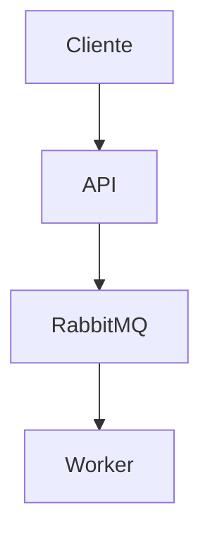

# Documentación de Arquitectura - sim-arqui-v4

Esta carpeta contiene la documentación arquitectónica del proyecto utilizando el **C4 Model** (Context, Containers, Components, Code).

## 📚 Índice de Diagramas

### Nivel 1: Contexto del Sistema
**Archivo:** [c4-level1-context.md](./c4-level1-context.md)

**Audiencia:** Stakeholders de negocio, Product Managers, Ejecutivos

**Pregunta que responde:** *"¿Qué hace el sistema y con quién interactúa?"*

**Elementos clave:**
- Usuarios/Clientes
- Sistema sim-arqui-v4 (caja negra)
- RabbitMQ (sistema externo)

---

### Nivel 2: Contenedores
**Archivo:** [c4-level2-containers.md](./c4-level2-containers.md)

**Audiencia:** Arquitectos, Tech Leads, DevOps

**Pregunta que responde:** *"¿Qué aplicaciones y servicios componen el sistema?"*

**Elementos clave:**
- API Container (.NET 8)
- Worker Container (.NET 8)
- RabbitMQ Container
- Comunicación AMQP entre contenedores

---

### Nivel 3: Componentes (API)
**Archivo:** [c4-level3-components-api.md](./c4-level3-components-api.md)

**Audiencia:** Desarrolladores, Code Reviewers

**Pregunta que responde:** *"¿Qué componentes internos tiene la API?"*

**Elementos clave:**
- Middleware pipeline (CorrelationId, JWT, Rate Limiting)
- Endpoint handlers (/orders, /token, /health)
- Infrastructure components (RabbitMQ, Metrics)

---

### Nivel 4: Código
**Archivo:** [c4-level4-code-example.md](./c4-level4-code-example.md)

**Audiencia:** Desarrolladores implementando features

**Pregunta que responde:** *"¿Cómo está implementado internamente?"*

**Nota:** Este nivel se documenta principalmente en el código con comentarios XML.

---

## 🔗 Relación con ADRs

Los diagramas C4 complementan los [Architecture Decision Records (ADRs)](../adr/README.md):

- **ADRs:** Documentan el **"por qué"** (decisiones y alternativas)
- **C4 Diagrams:** Documentan el **"qué"** (estructura y componentes)

### Ejemplo de uso conjunto:

**Pregunta:** *"¿Por qué se usa RabbitMQ?"*  
→ **Respuesta:** Ver [ADR-001: Selección de RabbitMQ](../adr/ADR-001-rabbitmq-selection.md)

**Pregunta:** *"¿Cómo se comunica la API con RabbitMQ?"*  
→ **Respuesta:** Ver [C4 Nivel 2: Contenedores](./c4-level2-containers.md)

---

## 📐 Herramientas para Diagramas

Actualmente usamos **diagramas ASCII en Markdown** para máxima portabilidad.

### Alternativas recomendadas:

#### 1. Structurizr DSL (Recomendado)
```dsl
workspace "sim-arqui-v4" {
    model {
        cliente = person "Cliente"
        sistema = softwareSystem "sim-arqui-v4" {
            api = container "API" "ASP.NET Core"
            worker = container "Worker" ".NET 8"
        }
        rabbitmq = softwareSystem "RabbitMQ" "Message Broker"
        
        cliente -> api "Envía órdenes"
        api -> rabbitmq "Publica mensajes"
        rabbitmq -> worker "Consume mensajes"
    }
    
    views {
        systemContext sistema {
            include *
        }
    }
}
```
**Pros:** Genera diagramas automáticamente, versionable en Git  
**Cons:** Requiere herramienta adicional

#### 2. Draw.io / Diagrams.net
**Pros:** UI visual, exporta a PNG/SVG  
**Cons:** Más difícil de versionar cambios

#### 3. Mermaid (Integrado en GitHub)

**Pros:** Renderiza en GitHub/Markdown  
**Cons:** Sintaxis menos expresiva que C4 DSL

---

## 🚀 Roadmap de Documentación

### v1.1
- [ ] Migrar diagramas ASCII a Structurizr DSL
- [ ] Agregar diagrama C4 para Worker components
- [ ] Secuencias de interacción (PlantUML)

### v2.0
- [ ] Diagramas de deployment (Kubernetes)
- [ ] Diagramas de estado (ciclo de vida de órdenes)
- [ ] Architecture characteristics matrix

---

## 📖 Referencias

- [C4 Model Official Site](https://c4model.com/)
- [Structurizr](https://structurizr.com/)
- [Simon Brown - Software Architecture for Developers](https://leanpub.com/software-architecture-for-developers)
- [Visualising Software Architecture](https://www.youtube.com/watch?v=x2-rSnhpw0g) (Video)

---

## 🤝 Contribuir

Para actualizar la documentación arquitectónica:

1. **Cambios menores:** Edita directamente los archivos .md
2. **Nuevos diagramas:** Sigue el formato existente (C4 levels)
3. **Decisiones arquitectónicas:** Crea un ADR en `/docs/adr/`
4. **Cambios significativos:** Discute en issue antes de PR

---
**Proyecto:** sim-arqui-v4  
**Mantenedor:** @LuisRaziel  
**Última actualización:** 2025-10-28