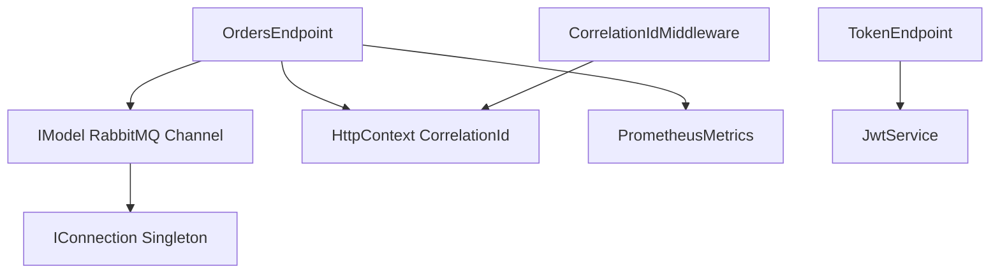

# C4 Model - Nivel 3: Componentes - API Container

## Propósito
Mostrar los componentes internos del **API Container** y cómo interactúan entre sí.

## Audiencia
- Desarrolladores trabajando en la API
- Code reviewers
- Tech Leads

---

## Diagrama de Componentes

```
┌──────────────────────────────────────────────────────────────────┐
│                        API Container                             │
│                                                                  │
│  ┌────────────────────────────────────────────────────────┐     │
│  │              HTTP Request Pipeline                     │     │
│  │                                                        │     │
│  │  ┌──────────────────────────────────────────────┐     │     │
│  │  │  1. CorrelationIdMiddleware                  │     │     │
│  │  │  • Genera/extrae X-Correlation-Id           │     │     │
│  │  │  • Enriquece LogContext                     │     │     │
│  │  │  • Agrega header a response                 │     │     │
│  │  └──────────────┬───────────────────────────────┘     │     │
│  │                 │                                      │     │
│  │  ┌──────────────▼───────────────────────────────┐     │     │
│  │  │  2. Authentication Middleware (JWT)          │     │     │
│  │  │  • Valida Bearer token                       │     │     │
│  │  │  • Extrae claims                             │     │     │
│  │  │  • Retorna 401 si inválido                   │     │     │
│  │  └──────────────┬───────────────────────────────┘     │     │
│  │                 │                                      │     │
│  │  ┌──────────────▼───────────────────────────────┐     │     │
│  │  │  3. Rate Limiting Middleware                 │     │     │
│  │  │  • Fixed window (50 req/min)                │     │     │
│  │  │  • Retorna 429 si excede límite             │     │     │
│  │  └──────────────┬───────────────────────────────┘     │     │
│  │                 │                                      │     │
│  │  ┌──────────────▼───────────────────────────────┐     │     │
│  │  │  4. HTTP Metrics Middleware                  │     │     │
│  │  │  • Captura latencia y status codes          │     │     │
│  │  └──────────────┬───────────────────────────────┘     │     │
│  └─────────────────┼──────────────────────────────────────┘     │
│                    │                                            │
│  ┌─────────────────▼────────────────────────────────────┐       │
│  │              Endpoint Handlers                       │       │
│  │                                                      │       │
│  │  ┌────────────────────────────────────────────┐     │       │
│  │  │  TokenEndpoint                             │     │       │
│  │  │  • POST/GET /token                         │     │       │
│  │  │  • Genera JWT con claims básicos          │     │       │
│  │  │  • TTL: 1 hora                             │     │       │
│  │  └────────────────────────────────────────────┘     │       │
│  │                                                      │       │
│  │  ┌────────────────────────────────────────────┐     │       │
│  │  │  OrdersEndpoint                            │     │       │
│  │  │  • POST /orders                            │     │       │
│  │  │  • Valida OrderRequest (orderId, amount)  │     │       │
│  │  │  • Crea envelope con correlationId        │     │       │
│  │  │  • Publica a RabbitMQ                     │     │       │
│  │  │  • Retorna 202 Accepted                    │     │       │
│  │  └────────────┬───────────────────────────────┘     │       │
│  │               │                                      │       │
│  │  ┌────────────────────────────────────────────┐     │       │
│  │  │  HealthEndpoint                            │     │       │
│  │  │  • GET /health                             │     │       │
│  │  │  • Retorna status: ok                      │     │       │
│  │  └────────────────────────────────────────────┘     │       │
│  │                                                      │       │
│  │  ┌────────────────────────────────────────────┐     │       │
│  │  │  MetricsEndpoint                           │     │       │
│  │  │  • GET /metrics                            │     │       │
│  │  │  • Expone formato Prometheus              │     │       │
│  │  └────────────────────────────────────────────┘     │       │
│  └──────────────────────────────────────────────────────┘       │
│                    │                                            │
│  ┌─────────────────▼────────────────────────────────────┐       │
│  │          Infrastructure Components                   │       │
│  │                                                      │       │
│  │  ┌────────────────────────────────────────────┐     │       │
│  │  │  RabbitMQPublisher                         │     │       │
│  │  │  • IModel (scoped)                         │     │       │
│  │  │  • BasicPublish con confirmaciones         │     │       │
│  │  │  • Crea exchange si no existe              │     │       │
│  │  └────────────┬───────────────────────────────┘     │       │
│  │               │                                      │       │
│  │  ┌────────────▼───────────────────────────────┐     │       │
│  │  │  RabbitMQConnection                        │     │       │
│  │  │  • IConnection (singleton)                 │     │       │
│  │  │  • AutomaticRecoveryEnabled = true         │     │       │
│  │  │  • Configurado vía environment vars        │     │       │
│  │  └────────────────────────────────────────────┘     │       │
│  │                                                      │       │
│  │  ┌────────────────────────────────────────────┐     │       │
│  │  │  JwtService                                │     │       │
│  │  │  • Genera tokens con JsonWebTokenHandler   │     │       │
│  │  │  • Configura signing credentials (HMAC)    │     │       │
│  │  │  • Secret key desde configuration          │     │       │
│  │  └────────────────────────────────────────────┘     │       │
│  │                                                      │       │
│  │  ┌────────────────────────────────────────────┐     │       │
│  │  │  PrometheusMetrics                         │     │       │
│  │  │  • Counter: orders_published_total         │     │       │
│  │  │  • HTTP metrics (latencia, status)         │     │       │
│  │  └────────────────────────────────────────────┘     │       │
│  └──────────────────────────────────────────────────────┘       │
└──────────────────────────────────────────────────────────────────┘
```

---

## Descripción de Componentes

### 🔧 **Middleware Components**

#### 1. CorrelationIdMiddleware
```csharp
// api/src/Middleware/CorrelationIdMiddleware.cs
public class CorrelationIdMiddleware
{
    private const string HeaderName = "X-Correlation-Id";
    
    public async Task Invoke(HttpContext context)
    {
        // Extrae o genera CorrelationId
        var cid = context.Request.Headers[HeaderName].FirstOrDefault()
                  ?? Guid.NewGuid().ToString("N");
        
        context.Items["CorrelationId"] = cid;
        context.Response.Headers[HeaderName] = cid;
        
        // Enriquece logs
        using (LogContext.PushProperty("CorrelationId", cid))
        {
            await _next(context);
        }
    }
}
```

**Responsabilidades:**
- ✅ Genera `CorrelationId` si no existe en request
- ✅ Agrega `X-Correlation-Id` header a response
- ✅ Enriquece `LogContext` de Serilog
- ✅ Propaga ID a RabbitMQ vía `OrdersEndpoint`

---

#### 2. JWT Authentication Middleware (Built-in)
```csharp
builder.Services.AddAuthentication(JwtBearerDefaults.AuthenticationScheme)
  .AddJwtBearer(o =>
  {
      o.TokenValidationParameters = new TokenValidationParameters
      {
          ValidateIssuerSigningKey = true,
          IssuerSigningKey = new SymmetricSecurityKey(key)
      };
  });
```

**Responsabilidades:**
- ✅ Valida firma HMAC-SHA256 del token
- ✅ Verifica expiración (`exp` claim)
- ✅ Extrae claims y los pone en `HttpContext.User`
- ✅ Retorna `401 Unauthorized` si inválido

---

#### 3. Rate Limiting Middleware
```csharp
builder.Services.AddRateLimiter(o =>
{
    o.RejectionStatusCode = 429;
    o.AddFixedWindowLimiter("orders", options =>
    {
        options.PermitLimit = 50;
        options.Window = TimeSpan.FromSeconds(60);
        options.QueueLimit = 5;
    });
});
```

**Responsabilidades:**
- ✅ Limita requests a 50/min por ventana fija
- ✅ Cola de 5 requests adicionales
- ✅ Retorna `429 Too Many Requests` si excede
- ✅ Configurable vía environment vars

---

### 🎯 **Endpoint Handlers**

#### TokenEndpoint
```csharp
app.MapMethods("/token", new[] { "GET", "POST" }, () =>
{
    var handler = new JsonWebTokenHandler();
    var desc = new SecurityTokenDescriptor
    {
        Subject = new ClaimsIdentity(claims),
        Expires = DateTime.UtcNow.AddHours(1),
        SigningCredentials = creds
    };
    
    var token = handler.CreateToken(desc);
    return Results.Ok(new { token });
});
```

**Input:** Ninguno (anónimo)  
**Output:** `{ "token": "eyJ..." }`  
**Claims generados:**
- `sub`: "demo-user"
- `jti`: Guid único
- `exp`: UTC + 1 hora

---

#### OrdersEndpoint
```csharp
app.MapPost("/orders", (OrderRequest req, IModel ch, HttpContext ctx) =>
{
    // 1. Validación básica
    if (req.OrderId == Guid.Empty || req.Amount <= 0)
        return Results.BadRequest(new { error = "invalid_order" });
    
    // 2. Crear envelope con CorrelationId
    var correlationId = ctx.Items["CorrelationId"]?.ToString();
    var envelope = new
    {
        version = "1.0",
        messageId = Guid.NewGuid(),
        correlationId = correlationId,
        timestamp = DateTime.UtcNow,
        data = req
    };
    
    // 3. Publicar a RabbitMQ
    var body = JsonSerializer.SerializeToUtf8Bytes(envelope);
    var props = ch.CreateBasicProperties();
    props.CorrelationId = correlationId;
    props.Headers["X-Correlation-Id"] = correlationId;
    
    ch.BasicPublish("orders.exchange", "orders.created", props, body);
    ordersPublishedTotal.Inc();
    
    // 4. Respuesta asíncrona
    return Results.Accepted($"/orders/{req.OrderId}", 
        new { status = "queued", req.OrderId });
})
.RequireAuthorization()  // ✅ JWT requerido
.RequireRateLimiting("orders");  // ✅ Rate limit aplicado
```

**Input:**
```json
{
  "orderId": "uuid",
  "amount": 123.45
}
```

**Output:**
```json
{
  "status": "queued",
  "orderId": "uuid"
}
```
**Status Code:** `202 Accepted`

**Validaciones:**
- ✅ JWT válido (middleware)
- ✅ Rate limit no excedido (middleware)
- ✅ `orderId` no vacío
- ✅ `amount` > 0

---

### 🏗️ **Infrastructure Components**

#### RabbitMQPublisher (IModel)
```csharp
builder.Services.AddScoped<IModel>(sp =>
{
    var conn = sp.GetRequiredService<IConnection>();
    var ch = conn.CreateModel();
    
    // Declarar exchange idempotente
    ch.ExchangeDeclare("orders.exchange", "topic", durable: true);
    
    return ch;
});
```

**Responsabilidades:**
- ✅ Proporciona canal AMQP (scoped por request)
- ✅ Declara exchanges al inicio
- ✅ Thread-safe (cada request tiene su propio channel)

**Nota:** IModel NO es thread-safe, por eso es `Scoped` y no `Singleton`.

---

#### RabbitMQConnection (IConnection)
```csharp
builder.Services.AddSingleton<IConnection>(sp =>
{
    var factory = new ConnectionFactory
    {
        HostName = host,
        UserName = user,
        Password = pass,
        AutomaticRecoveryEnabled = true,  // ✅ Reconexión automática
        NetworkRecoveryInterval = TimeSpan.FromSeconds(10)
    };
    
    return factory.CreateConnection();
});
```

**Responsabilidades:**
- ✅ Mantiene conexión persistente a RabbitMQ
- ✅ Reconecta automáticamente si se pierde conexión
- ✅ Thread-safe (IConnection sí lo es)

---

## Flujo de Datos: POST /orders

```
1. Request → CorrelationIdMiddleware
   ├─ Genera: X-Correlation-Id = "abc123"
   └─ Agrega a LogContext

2. → JWT Middleware
   ├─ Valida Bearer token
   └─ Si inválido: return 401

3. → Rate Limiting Middleware
   ├─ Verifica contador (50/min)
   └─ Si excede: return 429

4. → HTTP Metrics Middleware
   └─ Inicia timer para latencia

5. → OrdersEndpoint Handler
   ├─ Valida OrderRequest
   ├─ Crea envelope con CorrelationId
   ├─ ch.BasicPublish(exchange, routingKey, props, body)
   └─ ordersPublishedTotal.Inc()

6. → Response
   └─ 202 Accepted + X-Correlation-Id header
```

---

## Dependencias entre Componentes



---

## Configuración por Entorno

### Producción
```yaml
JWT__KEY: "<secret-from-key-vault>"
RABBITMQ__HOST: "rabbitmq-cluster.prod.svc"
RATELIMIT__PERMIT_LIMIT: "100"
ASPNETCORE_URLS: "http://+:8080"
RequireHttpsMetadata: true  # ✅ HTTPS obligatorio
```

### Desarrollo
```yaml
JWT__KEY: "dev-local-change-me"
RABBITMQ__HOST: "localhost"
RATELIMIT__PERMIT_LIMIT: "50"
RequireHttpsMetadata: false  # ⚠️ Solo para dev
```

---

## Testing

### Endpoint Testing
```bash
# 1. Obtener token
TOKEN=$(curl -s http://localhost:8080/token | jq -r '.token')

# 2. Enviar orden válida
curl -i -X POST http://localhost:8080/orders \
  -H "Authorization: Bearer $TOKEN" \
  -H "Content-Type: application/json" \
  -d '{"orderId":"11111111-1111-1111-1111-111111111111","amount":99.99}'

# Esperado: 202 Accepted + header X-Correlation-Id
```

### Rate Limiting Test
```bash
# Enviar 51 requests rápidamente
for i in {1..51}; do
  curl -s -o /dev/null -w "%{http_code}\n" \
    -H "Authorization: Bearer $TOKEN" \
    -X POST http://localhost:8080/orders \
    -d '{"orderId":"uuid","amount":1}'
done

# Últimas requests deben retornar 429
```

---

## Referencias
- [C4 Model - Component Diagram](https://c4model.com/#ComponentDiagram)
- [Program.cs Source](../../api/src/Program.cs)
- [CorrelationIdMiddleware Source](../../api/src/Middleware/CorrelationIdMiddleware.cs)
- [ADR-002: JWT Authentication](../adr/ADR-002-jwt-authentication.md)

---
**Última actualización:** 2025-10-28  
**Autor:** @LuisRaziel  
**Versión del diagrama:** 1.0